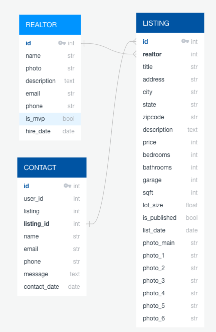

# BT Real Estate House Sales CMS

Welcome to the BT Real Estate House Sales Content Management System (CMS) project. This CMS allows BT Real Estate staff to manage and showcase house listings for sale in the USA. Potential clients can view these listings, request further information, or schedule visits.

## Installation

### Prerequisites

You need `Python 3.12` and `docker compose` on your local machine.

To get started with this project, follow these installation steps:

### 1. Install Python Requirements with Poetry

We use Poetry to manage Python dependencies in this project. Make sure you have Poetry installed, and then run the following commands:

```bash
# Install Poetry (if not already installed)
pip install poetry

# Install project dependencies
poetry install
```

This will set up a virtual environment and install all the required Python packages.

### 2. Run Docker Compose for the Database

We use Docker Compose to manage the project's database. To run the database, make sure you have Docker and Docker Compose installed, and then execute the following:

```bash
# Start the database container
docker-compose up -d
```

This will start a PostgreSQL database container for the CMS.

### 3. Start the Django Server

Once the database is running, you can start the Django server:

```bash
# Activate the virtual environment
poetry shell

# Apply database migrations
python manage.py migrate

# Create a superuser for the admin panel (follow the prompts)
python manage.py createsuperuser

# Start the Django development server
python manage.py runserver
```

You can now access the CMS by navigating to `http://127.0.0.1:8000` in your web browser. The admin panel is available at `http://127.0.0.1:8000/admin/` where you can log in with the superuser credentials created earlier.

## Project Description

BT Real Estate House Sales CMS is designed for BT Real Estate, a company that specializes in selling houses in the USA. This CMS is a one-stop solution for managing house listings. Some of the key features include:

- Listing Management: Easily create, edit, and delete house listings, including details like property type, location, price, and images.
- Client Interaction: Potential clients can view listings, request additional information, or schedule visits directly through the platform.
- User Authentication: Securely manage staff accounts and user access levels.
- Data Visualization: Explore the data model used in the database by referring to the [Data Model](data_model.png) diagram.

If you have any questions or need further assistance, feel free to reach out to our team.

Thank you for using the BT Real Estate House Sales CMS!

## Data Model


